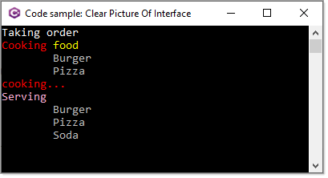

# About

There are plenty of examples for using interfaces on the web that for some either do not make sense or they are not relatable to what a developer needs to apply to their code.

This project uses an analogy of placing an order in a restaurant, placing an order which my guess is everyone has done at least once and for most many times.

Being relatable to a real live experience makes learning easier.

**Simple menu**

- Pizza
- Burger
- Soda/pop

Interface for food require cooking (pizza, burger)

```csharp
public interface IFood
{
    void Cook();
}
```

Class a menu item (soda/pop, pizza, burger), just enough code to learn from.
```csharp
public abstract class MenuItem
{
    public string Name { get; set; }
    public abstract void BringToTable();
}
```

**Soda/pop** does not need to be cooked so we only need `MenuItem`

```csharp
public class Soda : MenuItem
{
    public override void BringToTable()
    {
        Console.WriteLine($"\t{nameof(Soda)}");
    }
}
```

**Burger/pizza** needs cooking so we implement `IFood` and is a menu item which means we will implement `MenuItem`.

```csharp
public class Burger : MenuItem, IFood
{
    public override void BringToTable()
    {
        Console.WriteLine($"\t{nameof(Burger)}");
    }
    public void Cook()
    {
        Console.WriteLine($"\t{nameof(Burger)}");
    }
}

public class Pizza : MenuItem, IFood
{
    public override void BringToTable()
    {
        Console.WriteLine($"\t{nameof(Pizza)}");
    }

    public void Cook()
    {
        Console.WriteLine($"\t{nameof(Pizza)}");
    }
}
```

**Note** When implementing a class and interface you must implement the class then the interface.

Last model/class is `Waiter` who takes orders and brings the orders to the customer.

```csharp
public class Waiter
{
    public void TakeOrder(IEnumerable<MenuItem> order)
    {

        // Cook first (all except soda because soda is not IFood)
        AnsiConsole.MarkupLine("[red]Cooking[/] [yellow]food[/]");
        foreach (var food in order.OfType<IFood>())
        {
            food.Cook();
        }

        AnsiConsole.Status()
            .Start("[cyan]Preparing...[/]", ctx =>
            {
                ctx.Spinner(Spinner.Known.Star);
                ctx.SpinnerStyle(Style.Parse("yellow"));

                AnsiConsole.MarkupLine("[red]cooking...[/]");
                Thread.Sleep(2000);
            });

        // Bring all to the table (everything, including soda, pizza and burger because they're all menu items)
        AnsiConsole.MarkupLine("[pink1]Serving[/]");
        foreach (MenuItem menuItem in order)
        {
            menuItem.BringToTable();
        }
    }
}
```
</br>

