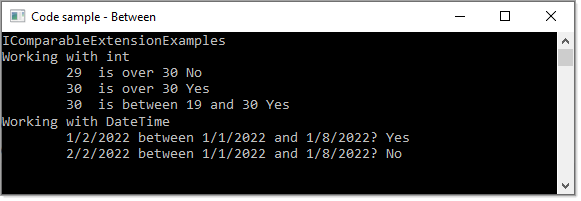

# Using Interfaces

When someone sets out to learn programming, in this case with C# more times than not they think procedurally, not object oriented. This means writing their code in one class, form or window and as a project grows several things happen. First, code becomes unmanageable simply because all the code resides in one location, a form, and window and even in some case a web page (even though there are templates). Secondly they will have different names for object method and property names which makes maintaining code difficult.

*I've intentionally kept most of the code samples simple for easy of learning. Once you have the basics down work on learning dependency injection.*

Then the next level is well my (some developer) code is unmanageable so it's time to use classes but never consider using interfaces as for many it is a foreign idea and never take time to learn about using interfaces.

## So what do interfaces give us?

### Code readability

When interface names are well thought out they describe intent. 

Example, we are part of a restaurant and have many items that requiring cooking

We can have an interface which has a method to cook.

```csharp
public interface IFood
{
    void Cook();
}
```

We implement `IFood` on

```csharp
public class Burger : MenuItem, IFood
{
    public override void BringToTable()
    {
        Console.WriteLine($"\t{nameof(Burger)}");
    }
    public void Cook()
    {
        Console.WriteLine($"\t{nameof(Burger)}");
    }
}
```

While for soda/pop requires no cooking

```csharp
public class Soda : MenuItem
{
    public override void BringToTable()
    {
        Console.WriteLine($"\t{nameof(Soda)}");
    }
}
```

What is `MenuItem` ? This class defines any item on a restaurant menu excluding other properties like size and price for instance for clarity for using an interface.

```csharp
public abstract class MenuItem
{
    public string Name { get; set; }
    public abstract void BringToTable();
}
```


### Code maintainability and consistency


Base example, one developer on a team creates the following model

```csharp
class Customer
{
    public int CustomerId { get; set; }
    public string FName { get; set; }
    public string LName { get; set; }
    public DateTime DateTime { get; set; }
}
```

Another developer in another project creates the following model

```csharp
class Customer
{
    public int CustomerId { get; set; }
    public string firstName { get; set; }
    public string lastName { get; set; }
    public DateTime SomeDateTime { get; set; }
}
```

There is no consistency and naming conventions do not follow standards.

By forcing these developers to use an interface e.g.

```csharp
interface IHuman
{
    public int Id { get; }
    public string FirstName { get; set; }
    public string LastName { get; set; }
    public DateTime BirthDate { get; set; }
}
```

We now have `consistency` and proper `naming standards`.

```csharp
class Customer : IHuman
{
    public int CustomerId { get; set; }
    public int Id => CustomerId;
    public string FirstName { get; set; }
    public string LastName { get; set; }
    public DateTime BirthDate { get; set; }
}
```

We can then apply this interface to another model and have consistency and proper naming standards.

```csharp
class Employee : IHuman
{
    public int EmployeeId { get; set; }
    public int Id => EmployeeId;
    public string FirstName { get; set; }
    public string LastName { get; set; }
    public DateTime BirthDate { get; set; }
}
```

Now suppose we have a Customer and Employee, by implementing IHuman we don't need to know the primary key is `CustomerId` or `EmployeeId`.

Let's create a mix list of Customer and Employee

 ```csharp
public class Mocking
{
    public static List<IHuman> List() => new ()
    {
        new Customer()
        {
            CustomerId = 1, 
            BirthDate = new DateTime(1999, 12, 3), 
            FirstName = "Bill", 
            LastName = "Jones"
        },
        new Employee()
        {
            EmployeeId = 2, 
            BirthDate = new DateTime(2001, 1, 4), 
            FirstName = "Mary", 
            LastName = "Gallagher"
        },
        new Employee()
        {
            EmployeeId = 4, 
            BirthDate = new DateTime(1980,9,1), 
            FirstName = "Jim", LastName = "Adams"
        }
    };
}
```

When traversing the list we ask for `Id` not the actual key as `Id` points to the actual key and we have no reason to alter the key.

```csharp
public class WorkOperations
{
    public static void IterateHumans()
    {
        var humans = Mocking.List();
        foreach (var human in humans)
        {
            Console.WriteLine($"{human.GetType().Name,-12} {human.Id,-3}{human.FirstName,-12}{human.LastName,-12}{human.BirthDate:d}");
        }
    }
}
```

</br>

Suppose a project has several models where each one requires get, get all, update, add, delete and save

If you have no rules and two developers not talking to each other, each will more likely than not have their own method names and one or both may not have implemented all methods.

For consistency a rule is to implement the following interface for, in this case ManagerOperations class.

```csharp
public interface IModelEntity<T>
{
    T GetById(int id);
    T Update(T model);
    T Add(T model);
    T Delete(int id);
    int Commit();
    Task<int> CommitAsync();
    List<T> GetAll();
}
```
Finished, ready for coding methods.

```csharp
public class Manager : IHuman
{
    public int ManagerIdentifier { get; set; }
    public int Id => ManagerIdentifier;
    public string FirstName { get; set; }
    public string LastName { get; set; }
    public DateTime BirthDate { get; set; }

}

public class ManagerOperations : IModelEntity<Manager>
{
    public Manager GetById(int id)
    {
        throw new NotImplementedException();
    }
    public Manager Update(Manager model)
    {
        throw new NotImplementedException();
    }
    public Manager Add(Manager model)
    {
        throw new NotImplementedException();
    }
    public Manager Delete(int id)
    {
        throw new NotImplementedException();
    }
    public int Commit()
    {
        throw new NotImplementedException();
    }
    public Task<int> CommitAsync()
    {
        throw new NotImplementedException();
    }
    public List<Manager> GetAll()
    {
        throw new NotImplementedException();
    }
}
```

Now we have another model, Taxpayer, implmentation is the same as Manager.

```csharp
public class Taxpayer : IHuman
{
    public int TaxpayerIdentifier { get; set; }
    public int Id => TaxpayerIdentifier;
    public string FirstName { get; set; }
    public string LastName { get; set; }
    public DateTime BirthDate { get; set; }
}

public class TaxpayerOperations : IModelEntity<Taxpayer>
{
    public Taxpayer GetById(int id)
    {
        throw new NotImplementedException();
    }
    public Taxpayer Update(Taxpayer model)
    {
        throw new NotImplementedException();
    }
    public Taxpayer Add(Taxpayer model)
    {
        throw new NotImplementedException();
    }
    public Taxpayer Delete(int id)
    {
        throw new NotImplementedException();
    }
    public int Commit()
    {
        throw new NotImplementedException();
    }
    public Task<int> CommitAsync()
    {
        throw new NotImplementedException();
    }
    public List<Taxpayer> GetAll()
    {
        throw new NotImplementedException();
    }
}
```

Follow the above or similar for maintainability and consistency in your projects.


### INotifyPropertyChanged Interface

The interface is used to communicate to view that some properties in view model have changed. 


- See project INotifyPropertyChangedExample
  - SqlOperationsEntityFrameworkCore.Projections.`Products` implement this interface
 

### IEquatable&lt;T>

- See project IEquatableExample which implements this interface for equality between two instances of a Person class, on string properties case insensitive.

**Results**


What about working with multiple interfaces in tangent with classes? They are addressed in each of the projects with names starting with `Lesson`.

Still not clear on working with interfaces? Take a look at the project `ClearPictureOnInterfaces` and read it's `readme.md` file.


### IFormatProvider

The IFormatProvider interface supplies an object that provides formatting information for formatting and parsing operations. Formatting operations convert the value of a type to the string representation of that value. Typical formatting methods are the ToString methods of a type, as well as Format.

- See project IFormatProviderExample which demonstrates formatting literal strings for a SQL INSERT statement propery by data type. Note this does not circument using parameters when using a command object.

The .NET Framework includes the following three predefined IFormatProvider implementations to provide culture-specific information that is used in formatting or parsing numeric and date and time values:

1. The `NumberFormatInfo` class, which provides information that is used to format numbers, such as the currency, thousands separator, and decimal separator symbols for a particular culture. For information about the predefined format strings recognized by a NumberFormatInfo object and used in numeric formatting operations, see Standard Numeric Format Strings and Custom Numeric Format Strings.
2. The `DateTimeFormatInfo` class, which provides information that is used to format dates and times, such as the date and time separator symbols for a particular culture or the order and format of a date's year, month, and day components. For information about the predefined format strings recognized by a DateTimeFormatInfo object and used in numeric formatting operations, see Standard Date and Time Format Strings and Custom Date and Time Format Strings.
3. The `CultureInfo` class, which represents a particular culture. Its GetFormat method returns a culture-specific NumberFormatInfo or DateTimeFormatInfo object, depending on whether the CultureInfo object is used in a formatting or parsing operation that involves numbers or dates and times.

## Dependency Injection

In short, interfaces are used often for registering servicecs of an application. I recommend reading the [following page](https://docs.microsoft.com/en-us/aspnet/core/fundamentals/dependency-injection?view=aspnetcore-6.0).

For ASP.NET Core configuration is done in Startup.cs similar to the following.

**Note** the connection string initialization has been left out for clarity of other code, see the [following](https://docs.microsoft.com/en-us/ef/core/miscellaneous/connection-strings) for more on connecting to databases in ASP.NET Core.

```csharp
public class Startup
{
    public Startup(IConfiguration configuration)
    {
        Configuration = configuration;
    }

    public IConfiguration Configuration { get; }

    public void ConfigureServices(IServiceCollection services)
    {
        services.AddControllers();

        var connString = ""; // get from config
        services.AddDbContext<ImmutableCacheDbContext>(options => options.UseSqlServer(connString));
        services.AddMemoryCache();
        services.AddScoped<ILotNamesCache, LotNamesCache>();
    }

    public void Configure(IApplicationBuilder app, IHostEnvironment env)
    {
        if (env.IsDevelopment())
        {
            app.UseDeveloperExceptionPage();
        }

        app.UseRouting();

        app.UseEndpoints(endpoints =>
        {
            endpoints.MapControllers();
        });
    }
}
```

Besides services even working with obtaining information from appsettings.json uses an interface.

```csharp
private static IConfigurationRoot Builder()
{
    var builder = new ConfigurationBuilder().AddJsonFile("appsettings.json");
    var configuration = builder.Build();
    return configuration;
}
```

#### See also

[.NET Generic Host in ASP.NET Core](https://docs.microsoft.com/en-us/aspnet/core/fundamentals/host/generic-host?view=aspnetcore-6.0)

## IReadOnlyList

Represents a read-only collection of elements that can be accessed by index.

Example, present a list of options in a dropdown where there is a rule to not allow alteration of the list.

Here a list is created from a database table with permissions set to prohibit altering current values along with providing the first item to force the user to make a selection which in a real application may not be needed.

```csharp

using System.Collections.Generic;
using System.Collections.Immutable;
using System.Data.SqlClient;
using DataLibrary.Models;

namespace DataLibrary.Classes
{
    public class SqlServerOperations
    {
        protected static string ConnectionString = "Server=.\\SQLEXPRESS;Database=NorthWind2020;Integrated Security=true";
        public static IReadOnlyList<CountryItem> CountriesReadOnly()
        {
            List<CountryItem> list = new() { new CountryItem(-1, "Select") };

            using var cn = new SqlConnection(ConnectionString);
            using var cmd = new SqlCommand { Connection = cn, CommandText = "SELECT CountryIdentifier, [Name] FROM dbo.Countries;" };
            cn.Open();
            var reader = cmd.ExecuteReader();

            while (reader.Read())
            {
                list.Add(new CountryItem(reader.GetInt32(0), reader.GetString(1)) );
            }

            return list.ToImmutableList();
        }
    }
}

```

:green_circle: Source code for above is not in this solution but is located [here](https://github.com/karenpayneoregon/basic-immutability-csharp/blob/master/DataLibrary/Classes/SqlServerOperations.cs).


## IComparable

Defines a generalized type-specific comparison method that a value type or class implements to order or sort its instances.

A good example is to get items between two elements using a generic language extension

```csharp
public static class GenericExtensions
{

	public static bool Between<T>(this T value, T lowerValue, T upperValue) 
		where T : struct, IComparable<T> 
		=> Comparer<T>.Default.Compare(value, lowerValue) >= 0 && 
		   Comparer<T>.Default.Compare(value, upperValue) <= 0;
}
```

Example using an `int` (source in project IComparableExample)

```csharp
int age = 29;

Console.WriteLine($"\t{age,-3} is over 30 {age.Between(30, 30).ToYesNo()}");

age = 30;
Console.WriteLine($"\t{age,-3} is over 30 {age.Between(30, 30).ToYesNo()}");

age = 30;
Console.WriteLine($"\t{age,-3} is between 19 and 30 {age.Between(19, 30).ToYesNo()}");

age = 12;
Console.WriteLine($"\tis child {age.IsChild().ToYesNo()}");
```

Same extension with DateTime

```csharp
Console.WriteLine("Working with DateTime");
    DateTime lowDateTime = new(2022, 1, 1);
    DateTime someDateTime = new(2022, 1, 2);
    DateTime highDateTime = new(2022, 1, 8);

    Console.WriteLine($"\t{someDateTime:d} between {lowDateTime:d} and {highDateTime:d}? {someDateTime.Between(lowDateTime, highDateTime).ToYesNo()}");

    someDateTime = new DateTime(2022, 2, 2);
    Console.WriteLine($"\t{someDateTime:d} between {lowDateTime:d} and {highDateTime:d}? {someDateTime.Between(lowDateTime, highDateTime).ToYesNo()}");
```

</br>



We can also do  `IsGreaterThan` and `IsLessThan` with `IComparable`

```csharp
public static bool IsGreaterThan<T>(this T sender, T value) where T : IComparable
    => sender.CompareTo(value) > 0;

public static bool IsLessThan<T>(this T sender, T value) where T : IComparable 
    => sender.CompareTo(value) < 0;
```

</br>

## Code reviews

To enforce rules there must be code reviews, preferably before allowing changes being pushed to source control. And for even better control have developers write unit test which must not break code done by other developers.

Code reviews should be done frequently, otherwise with a large code review the consequences sometimes can lead to accepting code to stay on track of a timeline.

Most teams I have worked on require peer code reviews and senior dev code reviews then have rules in source control to run all unit test, if one fails reject the commit while all pass allow the commit. 


# Definitions

- *Definitions* (usually at the top of an article but done later on purpose)
 
  - [Interfaces](https://docs.microsoft.com/en-us/dotnet/csharp/language-reference/keywords/interface): An interface defines a contract. Any class or struct that implements that contract must provide an implementation of the members defined in the interface. *A lead developer writes interfaces for code logic and provides them to other developers to use.*
  - An `interface` contains definitions for a group of related functionalities that a non-abstract class or a struct must implement. An interface may define static methods, which must have an implementation. Beginning with C# 8.0, an interface may define a default implementation for members. An interface may not declare instance data such as fields, auto-implemented properties, or property-like events. ([Microsoft docs](https://docs.microsoft.com/en-us/dotnet/csharp/fundamentals/types/interfaces))
  - [Abstract](https://docs.microsoft.com/en-us/dotnet/csharp/language-reference/keywords/abstract) classes: Use the abstract modifier in a class declaration to indicate that a class is intended only to be a `base class` of other classes, not instantiated on its own. Members marked as abstract must be implemented by non-abstract classes that derive from the abstract class. *We wil use an abstract class for special usage in place of an interface in a provided code sample.*

## Interface benefits

The main benefit is about code readability, code maintainability and code "semantics".

- **Code readability**: An interface constitutes a declaration about intentions. It defines a capability of your class, what your class is capable of doing. 
- **Code semantics**: By providing interfaces and implementing them you're actively separating concepts in a similar way HTML and CSS does. A class is a concrete implementation of an "object class" some way of representing the reality by modeling general properties of real life objects or concepts. An interface define a behavioral model, a definition of what an object can do. Separating those concepts keeps the semantics of your code more clear.
- **Code maintainability**: Interfaces helps to reduce coupling and therefore allow you to easily interchange implementations for the same concept without the underlying code being affected. 
- Implement [Dependency injection](https://en.wikipedia.org/wiki/Dependency_injection)

```csharp
List<IBaseEntity> list = new()
{
    new Customer() { CustomerIdentifier = 1, Name = "SomeCustomer", ContactIdentifier = 2 },
    new Car() { CarId = 1, Name = "Car 1" },
};
```

## See also

[More on interfaces](https://github.com/karenpayneoregon/oed-working-with-interfaces)

## Commonly used interfaces

- IEnumerable (and IEnumerable): for use with foreach and LINQ
- IDisposable: for resources requiring cleanup, used with using (see [the following post](https://stackoverflow.com/questions/538060/proper-use-of-the-idisposable-interface))
- ICloneable: allows creating objects of a class having same values as another instance using the Clone method.
- IQueryable: lets you execute requests against queriable data sources.
- INotifyPropertyChange : For data binding to UI classes in WPF, winforms
- IComparable and IComparer: for generalized sorting
- IEquatable and IEqualityComparer: for generalized equality
- IList and ICollection: for mutable collections
- IDictionary: for lookup collections