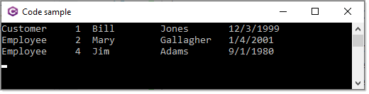

# Using Interfaces

**TODO Write intro and Summary**

Base example, one developer on a team creates the following model

```csharp
class Customer
{
    public int CustomerId { get; set; }
    public string FName { get; set; }
    public string LName { get; set; }
    public DateTime DateTime { get; set; }
}
```

Another developer in another project creates the following model

```csharp
class Customer
{
    public int CustomerId { get; set; }
    public string firstName { get; set; }
    public string lastName { get; set; }
    public DateTime SomeDateTime { get; set; }
}
```

There is no consistency and naming conventions do not follow standards.

By forcing these developers to use an interface e.g.

```csharp
interface IHuman
{
    public int Id { get; }
    public string FirstName { get; set; }
    public string LastName { get; set; }
    public DateTime BirthDate { get; set; }
}
```

We now have `consistency and` proper `naming standards`.

```csharp
class Customer : IHuman
{
    public int CustomerId { get; set; }
    public int Id => CustomerId;
    public string FirstName { get; set; }
    public string LastName { get; set; }
    public DateTime BirthDate { get; set; }
}
```

We can then apply this interface to another model and have consistency and proper naming standards.

```csharp
class Employee : IHuman
{
    public int EmployeeId { get; set; }
    public int Id => EmployeeId;
    public string FirstName { get; set; }
    public string LastName { get; set; }
    public DateTime BirthDate { get; set; }
}
```

Now suppose we have a Customer and Employee, by implementing IHuman we don't need to know the primary key is `CustomerId` or `EmployeeId`.

Let's create a mix list of Customer and Employee

 ```csharp
public class Mocking
{
    public static List<IHuman> List() => new ()
        {
            new Customer() { CustomerId = 1, BirthDate = new DateTime(1999, 12, 3), FirstName = "Bill", LastName = "Jones" },
            new Employee() { EmployeeId = 2, BirthDate = new DateTime(2001, 1, 4), FirstName = "Mary", LastName = "Gallagher" },
            new Employee() {EmployeeId = 4, BirthDate = new DateTime(1980,9,1), FirstName = "Jim", LastName = "Adams"}
        };
}
```

When traversing the list we ask for `Id` not the actual key as `Id` points to the actual key and we have no reason to alter the key.

```csharp
public class WorkOperations
{
    public static void IterateHumans()
    {
        var humans = Mocking.List();
        foreach (var human in humans)
        {
            Console.WriteLine($"{human.GetType().Name,-12} {human.Id,-3}{human.FirstName,-12}{human.LastName,-12}{human.BirthDate:d}");
        }
    }
}
```

**Results**




What about working with multiple interfaces in tangent with classes? They are addressed in each of the projects with names starting with `Lesson`.

Still not clear on working with interfaces? Take a look at the project `ClearPictureOnInterfaces` and read it's `readme.md` file.

# Code reviews

To enforce rules there must be code reviews, preferably before allowing changes being pushed to source control. And for even better control have developers write unit test which must not break code done by other developers.

Code reviews should be done frequently, otherwise with a large code review the consequences sometimes can lead to accepting code to stay on track of a timeline.

Most teams I have worked on require peer code reviews and senior dev code reviews then have rules in source control to run all unit test, if one fails reject the commit while all pass allow the commit. 

# Summary

**TODO**


# Definitions

- *Definitions* (usually at the top of an article but done later on purpose)
 
  - [Interfaces](https://docs.microsoft.com/en-us/dotnet/csharp/language-reference/keywords/interface): An interface defines a contract. Any class or struct that implements that contract must provide an implementation of the members defined in the interface. *A lead developer writes interfaces for code logic and provides them to other developers to use.*
  - An `interface` contains definitions for a group of related functionalities that a non-abstract class or a struct must implement. An interface may define static methods, which must have an implementation. Beginning with C# 8.0, an interface may define a default implementation for members. An interface may not declare instance data such as fields, auto-implemented properties, or property-like events. ([Microsoft docs](https://docs.microsoft.com/en-us/dotnet/csharp/fundamentals/types/interfaces))
  - [Abstract](https://docs.microsoft.com/en-us/dotnet/csharp/language-reference/keywords/abstract) classes: Use the abstract modifier in a class declaration to indicate that a class is intended only to be a `base class` of other classes, not instantiated on its own. Members marked as abstract must be implemented by non-abstract classes that derive from the abstract class. *We wil use an abstract class for special usage in place of an interface in a provided code sample.*

## Interface benefits

The main benefit is about code readability, code maintainability and code "semantics".

- **Code readability**: An interface constitutes a declaration about intentions. It defines a capability of your class, what your class is capable of doing. 
- **Code semantics**: By providing interfaces and implementing them you're actively separating concepts in a similar way HTML and CSS does. A class is a concrete implementation of an "object class" some way of representing the reality by modeling general properties of real life objects or concepts. An interface define a behavioral model, a definition of what an object can do. Separating those concepts keeps the semantics of your code more clear.
- **Code maintainability**: Interfaces helps to reduce coupling and therefore allow you to easily interchange implementations for the same concept without the underlying code being affected. 
- Implement [Dependency injection](https://en.wikipedia.org/wiki/Dependency_injection)

```csharp
List<IBaseEntity> list = new()
{
    new Customer() { CustomerIdentifier = 1, Name = "SomeCustomer", ContactIdentifier = 2 },
    new Car() { CarId = 1, Name = "Car 1" },
};
```

## See also

[More on interfaces](https://github.com/karenpayneoregon/oed-working-with-interfaces)
